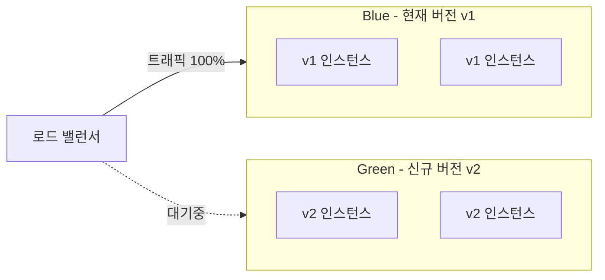
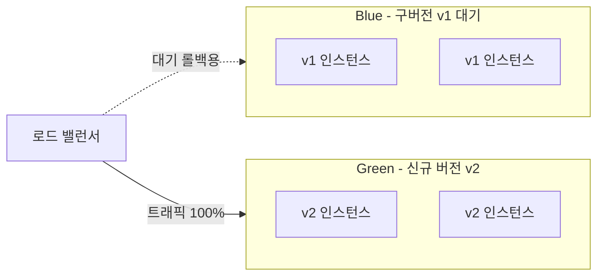
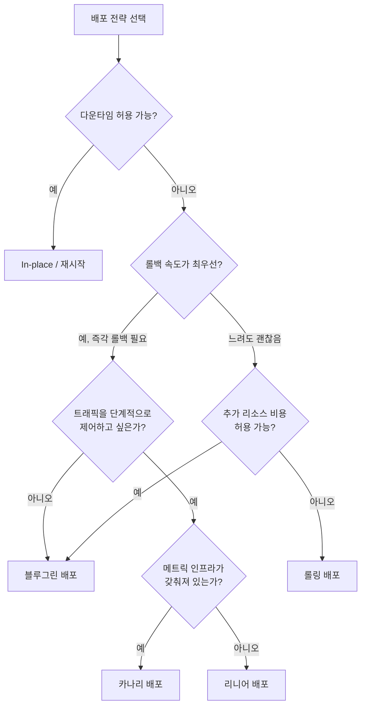

## 개요

서비스를 중단 없이 안전하게 배포하는 것은 현대 소프트웨어 운영의 핵심 과제다. 배포 전략은 "새 버전을 어떻게, 얼마나 빠르게, 얼마나 안전하게 트래픽에 노출할 것인가"를 결정하는 방식이다. 잘못된 배포 전략은 전체 서비스 장애로 이어질 수 있고, 반대로 적절한 전략은 빠른 배포 주기와 높은 안정성을 동시에 달성하게 해준다.

이 글에서는 가장 널리 쓰이는 4가지 배포 전략인 **카나리(Canary)**, **블루그린(Blue-Green)**, **롤링(Rolling)**, **리니어(Linear)** 배포를 개념부터 실전까지 정리한다.

---

## 배포 전략 비교 요약

| 전략 | 다운타임 | 롤백 속도 | 리소스 비용 | 트래픽 제어 | 위험도 |
|------|----------|-----------|-------------|-------------|--------|
| 롤링(Rolling) | 없음 | 느림 | 낮음 | 제한적 | 중간 |
| 블루그린(Blue-Green) | 없음 | 빠름 | 높음(2배) | 이진(0%/100%) | 낮음 |
| 카나리(Canary) | 없음 | 빠름 | 중간 | 세밀함 | 매우 낮음 |
| 리니어(Linear) | 없음 | 중간 | 중간 | 단계적 | 낮음 |

---

## 1. 롤링 배포 (Rolling Deployment)

### 개념

롤링 배포는 인스턴스(파드)를 **점진적으로 교체**하는 방식이다. 기존 버전의 인스턴스를 하나씩 종료하면서 새 버전의 인스턴스로 대체한다. Kubernetes의 기본 배포 전략이 바로 롤링 업데이트다.

```
배포 시작:
[v1] [v1] [v1] [v1]   ← 전체 v1

배포 중간:
[v2] [v2] [v1] [v1]   ← 절반 교체

배포 완료:
[v2] [v2] [v2] [v2]   ← 전체 v2
```

### Kubernetes 설정 예시

```yaml
apiVersion: apps/v1
kind: Deployment
metadata:
  name: my-app
spec:
  replicas: 4
  strategy:
    type: RollingUpdate
    rollingUpdate:
      maxUnavailable: 1    # 동시에 종료할 수 있는 최대 파드 수
      maxSurge: 1          # 동시에 추가 생성할 수 있는 최대 파드 수
  template:
    spec:
      containers:
      - name: my-app
        image: my-app:v2
```

### 장단점

**장점**
- 추가 인프라 비용이 없다 (기존 리소스 내에서 교체)
- 배포 중 서비스가 유지된다 (제로 다운타임)
- 설정이 단순하고 대부분의 컨테이너 오케스트레이터에서 기본 지원한다

**단점**
- 배포 중 v1과 v2가 동시에 운영되므로 **API 하위 호환성**이 반드시 보장되어야 한다
- 문제 발생 시 롤백이 느리다 (다시 순차적으로 교체해야 함)
- 배포 진행 중에는 트래픽 비율을 정밀하게 제어하기 어렵다

### 적합한 상황
- 빠른 배포보다 단순함을 우선할 때
- API 호환성이 완전히 보장된 패치/마이너 업데이트
- 리소스 비용이 제한된 환경

---

## 2. 블루그린 배포 (Blue-Green Deployment)

### 개념

블루그린 배포는 **동일한 환경을 두 벌** 운영하는 방식이다. 현재 프로덕션은 "블루(Blue)", 새 버전은 "그린(Green)" 환경에 배포한다. 준비가 완료되면 로드 밸런서의 트래픽을 블루에서 그린으로 한 번에 전환한다.



**전환 후:**



### AWS 환경 예시

AWS Elastic Beanstalk, CodeDeploy, 또는 ALB의 Target Group 교체로 구현 가능하다.

```bash
# ALB 리스너 규칙을 그린으로 전환
aws elbv2 modify-listener \
  --listener-arn $LISTENER_ARN \
  --default-actions Type=forward,TargetGroupArn=$GREEN_TARGET_GROUP_ARN

# 검증 후 블루 환경 정리 또는 유지
```

### Kubernetes에서 구현

```yaml
# 서비스의 selector만 바꿔서 트래픽 전환
apiVersion: v1
kind: Service
metadata:
  name: my-app-service
spec:
  selector:
    app: my-app
    version: green   # blue → green 으로 변경
  ports:
  - port: 80
    targetPort: 8080
```

### 장단점

**장점**
- 트래픽 전환이 즉각적이다 (배포 순간 100% 전환)
- 문제 발생 시 로드 밸런서 설정만 되돌리면 즉시 롤백된다
- 구버전 환경이 그대로 남아있어 비교 테스트가 용이하다
- v1/v2 동시 운영 기간이 없어 호환성 걱정이 줄어든다

**단점**
- 동일한 인프라를 두 벌 운영하므로 **비용이 약 2배**다
- 데이터베이스 스키마 변경이 있을 때 처리가 복잡해진다
- 100% 전환이기 때문에 신규 버전에 버그가 있으면 전체 사용자가 영향을 받는다

### 적합한 상황
- 즉각적인 롤백이 필수인 금융/결제 시스템
- 정기 점검 없이 배포해야 하는 24/7 서비스
- 프로덕션과 동일한 환경에서 최종 검증이 필요한 경우

---

## 3. 카나리 배포 (Canary Deployment)

### 개념

카나리 배포는 신규 버전을 **소수의 트래픽에만 먼저 노출**하고, 문제가 없으면 점진적으로 비율을 높이는 전략이다. 이름의 유래는 탄광 안전 도구였던 카나리아 새(독가스에 민감하여 위험을 먼저 감지)에서 왔다.

```
1단계: 신규 버전에 5% 트래픽 노출
[v2] [v1] [v1] [v1] [v1] [v1] [v1] [v1] [v1] [v1] [v1] [v1] [v1] [v1] [v1] [v1] [v1] [v1] [v1] [v1]
 5%                                                                                                95%

2단계: 메트릭 정상 → 25%로 확대
[v2][v2][v2][v2][v2] [v1][v1][v1][v1][v1][v1][v1][v1][v1][v1][v1][v1][v1][v1][v1]
      25%                                     75%

3단계: 메트릭 정상 → 100%
[v2][v2][v2][v2][v2][v2][v2][v2][v2][v2][v2][v2][v2][v2][v2][v2][v2][v2][v2][v2]
                                   100%
```

### Argo Rollouts를 사용한 카나리 구현

```yaml
apiVersion: argoproj.io/v1alpha1
kind: Rollout
metadata:
  name: my-app
spec:
  replicas: 10
  strategy:
    canary:
      steps:
      - setWeight: 5       # 1단계: 5% 트래픽
      - pause: {duration: 10m}   # 10분 관찰
      - setWeight: 25      # 2단계: 25%
      - pause: {duration: 10m}
      - setWeight: 50      # 3단계: 50%
      - pause: {}          # 수동 승인 대기
      - setWeight: 100     # 4단계: 전체 전환

      # 자동 롤백 조건 (Prometheus 메트릭 기반)
      analysis:
        templates:
        - templateName: success-rate
        args:
        - name: service-name
          value: my-app
---
apiVersion: argoproj.io/v1alpha1
kind: AnalysisTemplate
metadata:
  name: success-rate
spec:
  metrics:
  - name: success-rate
    interval: 1m
    successCondition: result[0] >= 0.95   # 성공률 95% 이상
    failureLimit: 3
    provider:
      prometheus:
        address: http://prometheus:9090
        query: |
          sum(rate(http_requests_total{status=~"2.."}[5m]))
          /
          sum(rate(http_requests_total[5m]))
```

### Istio를 활용한 트래픽 분할

서비스 메시(Istio)를 사용하면 쿠버네티스 파드 수 비율이 아닌 **정확한 트래픽 비율**로 제어할 수 있다.

```yaml
apiVersion: networking.istio.io/v1alpha3
kind: VirtualService
metadata:
  name: my-app
spec:
  http:
  - route:
    - destination:
        host: my-app
        subset: v1
      weight: 95
    - destination:
        host: my-app
        subset: v2
      weight: 5
```

### 장단점

**장점**
- 신규 버전의 문제를 소수 사용자에게만 노출한다 (위험 최소화)
- 실제 프로덕션 트래픽으로 성능·안정성을 검증한다
- 문제 발생 시 트래픽 비율을 0%로 즉시 되돌릴 수 있다
- A/B 테스트나 기능 플래그와 결합하면 사용자 세그먼트 제어도 가능하다

**단점**
- 카나리와 기존 버전이 함께 운영되므로 **API 호환성**이 필요하다
- 모니터링 및 분석 인프라가 갖춰져 있어야 효과적이다
- 배포 완료까지 시간이 걸린다
- 구성이 블루그린·롤링보다 복잡하다

### 적합한 상황
- 트래픽이 많고 안정성이 중요한 대형 서비스
- 빠른 실험과 데이터 기반 의사결정이 필요한 팀
- Prometheus, Datadog 등 메트릭 인프라가 이미 갖춰진 환경

---

## 4. 리니어 배포 (Linear Deployment)

### 개념

리니어 배포는 카나리 배포의 변형으로, 트래픽을 **일정한 간격으로 균등하게** 증가시키는 전략이다. "선형 배포"라고도 부른다. AWS CodeDeploy의 `Linear10PercentEvery1Minute` 같은 설정이 대표적이다.

```
시작:    [v2  5%] [v1 95%]
1분 후:  [v2 15%] [v1 85%]
2분 후:  [v2 25%] [v1 75%]
3분 후:  [v2 35%] [v1 65%]
4분 후:  [v2 45%] [v1 55%]
5분 후:  [v2 55%] [v1 45%]
...
완료:    [v2 100%]
```

카나리가 단계별로 사람이 승인하거나 특정 메트릭을 확인하며 진행하는 반면, 리니어는 **자동으로 일정한 속도로 증가**한다.

### AWS CodeDeploy 설정 예시

```json
{
  "deploymentConfigName": "my-linear-config",
  "trafficRoutingConfig": {
    "type": "TimeBasedLinear",
    "timeBasedLinear": {
      "linearPercentage": 10,
      "linearInterval": 1
    }
  }
}
```

위 설정은 매 1분마다 10%씩 트래픽을 증가시켜 10분 만에 완전 전환한다.

```yaml
# SAM/CloudFormation Lambda 함수 배포 예시
DeploymentPreference:
  Type: Linear10PercentEvery1Minute  # 매 분 10%씩 증가
  Alarms:
    - !Ref AliasErrorMetricGreaterThanZeroAlarm
  Hooks:
    PreTraffic: !Ref PreTrafficHookFunction
    PostTraffic: !Ref PostTrafficHookFunction
```

### 카나리 vs 리니어 차이

| 항목 | 카나리(Canary) | 리니어(Linear) |
|------|---------------|----------------|
| 트래픽 증가 방식 | 단계적, 비균등 (5% → 25% → 50% → 100%) | 균등 간격 (10% → 20% → 30% ...) |
| 진행 방식 | 수동 승인 또는 분석 기반 | 자동, 시간 기반 |
| 유연성 | 높음 | 낮음 |
| 복잡성 | 높음 | 낮음 |
| 문제 감지 시 대응 | 다음 단계 진행 차단 | 자동 롤백 또는 중단 |

### 장단점

**장점**
- 예측 가능하고 일정한 배포 속도를 보장한다
- 카나리보다 설정이 단순하다
- 자동화된 점진적 노출로 문제를 조기에 감지한다
- 배포 완료 시간을 예측할 수 있다

**단점**
- 트래픽 증가 속도를 상황에 맞게 유연하게 조정하기 어렵다
- 카나리처럼 특정 비율에서 오랜 시간 관찰하는 것이 불가능하다
- 배포 속도가 카나리보다 느릴 수 있다

### 적합한 상황
- AWS Lambda, API Gateway 같은 서버리스 환경
- 자동화된 배포 파이프라인을 구성할 때
- 카나리보다 단순한 점진적 배포가 필요한 경우

---

## 배포 전략 선택 가이드



### 실무 권장 조합

**소규모 팀 / 스타트업**
- 개발/스테이징: 롤링 배포
- 프로덕션: 블루그린 배포

**중규모 팀 / 성장 단계**
- 개발: 롤링 배포
- 스테이징: 블루그린 배포
- 프로덕션: 카나리 배포 (Argo Rollouts + Prometheus)

**대규모 팀 / 엔터프라이즈**
- 모든 환경: 카나리 배포
- 서버리스 함수: 리니어 배포 (AWS CodeDeploy)
- Feature Flag와 결합하여 코드 배포와 기능 출시를 분리

---

## 데이터베이스 마이그레이션과 배포 전략

배포 전략에서 가장 까다로운 부분 중 하나는 **DB 스키마 변경**이다. v1과 v2가 동시에 운영되는 시간이 발생하는 롤링·카나리·리니어 배포에서는 특히 중요하다.

### Expand-Contract 패턴

```
1단계 (Expand): 신규 컬럼 추가 (NULL 허용)
  → v1, v2 모두 동작 가능

2단계 (Migrate): 데이터 마이그레이션 실행
  → 배포와 별개로 진행

3단계 (배포): v2 배포
  → v2는 신규 컬럼 사용

4단계 (Contract): 구버전 컬럼 제거
  → v1이 완전히 사라진 후 별도 배포로 진행
```

이 패턴을 따르면 배포 중 구버전과 신버전의 DB 호환성을 유지할 수 있다.

---

## 정리

| 전략 | 핵심 특징 | 추천 환경 |
|------|-----------|-----------|
| 롤링 | 단순, 낮은 비용, 느린 롤백 | 호환성 보장된 업데이트, 소규모 서비스 |
| 블루그린 | 즉각 롤백, 높은 비용, 100% 전환 | 금융/결제 등 즉각 롤백이 중요한 서비스 |
| 카나리 | 세밀한 제어, 위험 최소화, 복잡 | 트래픽 많은 프로덕션, 메트릭 인프라 보유 |
| 리니어 | 예측 가능, 자동화, 단순 | 서버리스, 자동화 파이프라인 |

배포 전략은 팀의 성숙도, 인프라 환경, 비즈니스 요구사항에 맞게 선택해야 한다. 롤링으로 시작해 서비스가 성장하면 카나리로 전환하는 것이 일반적인 성장 경로다. 어떤 전략을 선택하든 **자동화된 롤백 조건**과 **충분한 모니터링**이 전제되어야 배포 전략이 실질적인 안전망이 된다.
